# Japanese Screenshot Miner
App to create automated cards for anki with images.

This app is focused on reading steam screenshots, but you can add another folders to be readed in the application.

## Index

- [Functionality](#functionality)
- [Instalation](#instalation)
- [Use the program](#usage)
- [Import CSV on Anki](#import-csv-on-anki)

## Functionality

This application reads images (in format `jpg`) included in the specified paths declared in the `screenshot_folders`. These images must be created in the present day.

Note: This program only reads `jpg` format.

Note: This program only reads images taken in the present day.

Note: This program ignores images with a parent folder called `thumbnails`.

## Instalation

### 1. Install Tesseract

To be able to apply OCR in this program, you must install tesseract in your system.

#### Arch-based OS:
```bash
sudo pacman -S tesseract tesseract-data-jpn
```

### 2. Install Python

This project was made using `python 3.14.2`:
#### Arch-based OS:
```bash
sudo pacman -S python
```

### 3. Install Git
To clone this repository, you need `git` installed in your system.

Note: As an alternative, you can clone this repository with the button: `<> Code` > `Download ZIP`.
#### Arch-based OS:
```bash
sudo pacman -S git
```

### 4. Clone the repository
Clone the repository with the following command:
```bash
git clone https://github.com/oscar00129/japanese-screenshot-miner.git
```
Note: As an alternative, you can clone this repository with the button: `<> Code` > `Download ZIP`.

### 5. Create a venv file (virtual environment)
Note: You NEED to be in the cloned project.
```bash
python -m venv venv
```

### 6. Activate the virtual environment

#### Linux:

```bash
source venv/bin/activate.fish
```

#### Windows:
```bat
venv/Scripts/activate
```

When you see a `venv >` in your console, you can proceed.

### 7. Install python dependencies
```bash
pip install -r requirements.txt
```

### 8. Configure screenshot folders

You can configure the screenshot folders in the `config.toml` file, we recommend use the steam folder.

This is an example using steam screenshot folder and Cachy Os linux screenshot folder:
```toml
screenshot_folders = [
    "/home/user/.local/share/Steam/userdata/123456789/123/remote/",
    "/home/user/Pictures/Screenshots/"
]
```

### 9. Configure anki folder

You can configure the anki files folder in the `config.toml` file. Its important to have one declared, there, the program will save a copy of the mined picture for study purposes.

This is an example using the pacman anki installed:
```toml
anki_img_folder = "/home/user/.local/share/Anki2/User/collection.media/"
```

## Usage

To run, please activate the virtual environment and run with python the `main.py` file.

#### Linux:
```bash
source venv/bin/activate.fish
python main.py
```

When the program runs, it will scan and filter the pictures.
When the process is completed, an interface is gonna to appear:

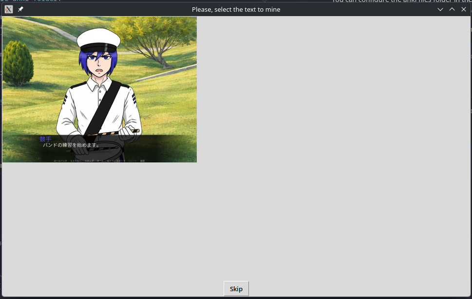

User must select with his mouse a region where the text is present.

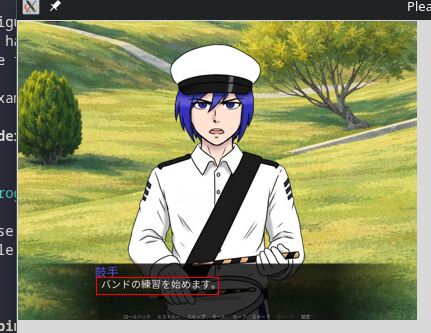

Inmediatly, another window will appear to confirm the selected section and to transcribe the detected text. If the user isn't sure about the detected text or detected region, you can click the `Retry` button to retry the selection.

Also, the user can edit the text for wharever they needs.


#### Bold text for anki usage

Note: For my personal use, I added a bold button to allow to the user select the new word that will be studied and marked in bold for Anki.

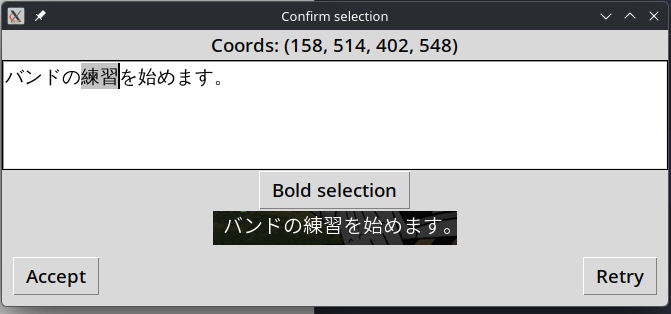

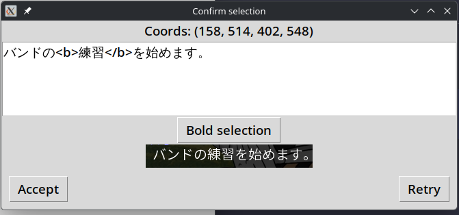

When user have finished to select all the photos, the program will finish.

The screenshots will be added into the anki photos folder and the csv file will be in the output folder.

#### Anki folder with screenshots added:

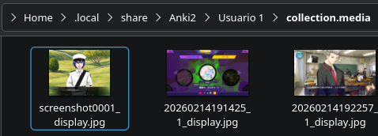

#### Output folder

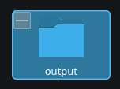


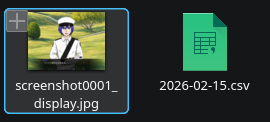

#### CSV content

With this CSV generated we can import it to anki.
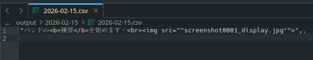

Personally, I like to add a definition for the word. Using AI we can make this more quickly. Here's the prompt I use for this case use:

```
Hi! please process this CSV for me. I want you to put in the second column the Japanese definition of the text that is inside the bold tags. Take the full sentence into account so that you can give me the definition for that specific use case.
If the definition is very complex and is easier to understand with an image, then instead of writing the definition, put the word “[IMAGE]” in the second column. That way I’ll know it’s better to look at images to understand that word.
If no bold tag is present in the sentence, then instead of writing the definition, put the word "[NO BOLD TAG]".
Leave the other columns unchanged.

"バンドの<b>練習</b>を始めます。<br>",,
```

## Import CSV on Anki

1. To import just use the button `Import File`.

    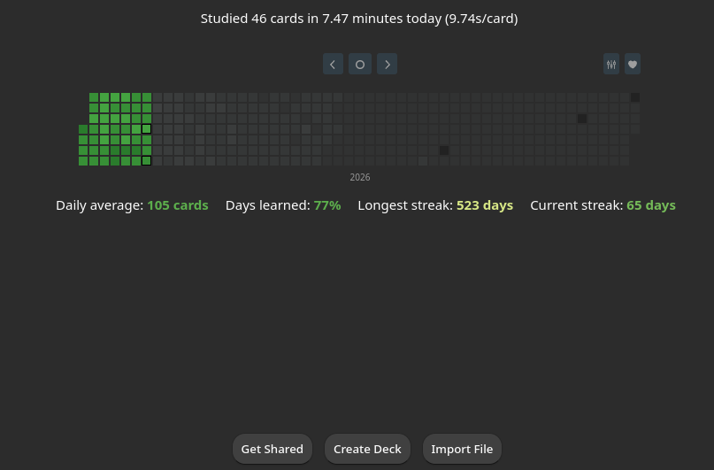

2. Select the file CSV. (In this case, the file is already processed by the AI).

    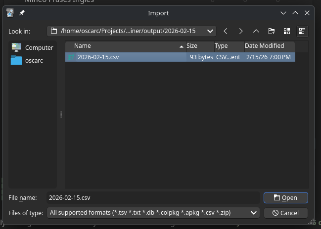

3. Configure the import options.

    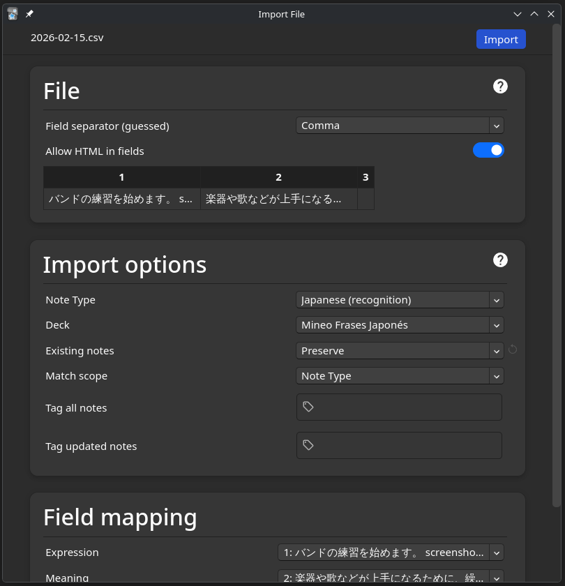

4. This window will appear to confirm the import success.

    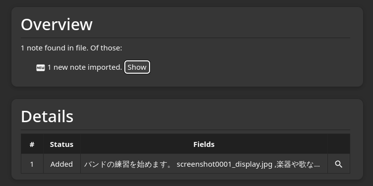

If you click the `Show` button, you can see all the cards imported and its content.

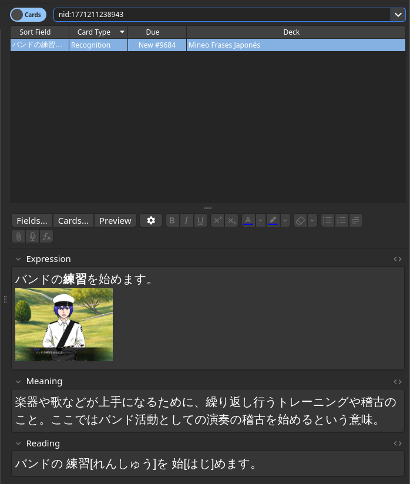

Note: The field `Reading` and the card type is automatically generated by [Anki Japanese Support Addon](https://ankiweb.net/shared/info/3918629684).